# 英文文献翻译格式整理器源码

## 一、软件开发灵感及相关说明

本人作为一枚科研小白，在阅读英文文献的时候，仅靠自己菜鸡的英语水平是无法流畅的阅读的，所以大多数情况下是需要借助翻译软件的。我的翻译过程是：Adobe Acrobat打开PDF文件，在编辑模式下对文本进行复制，再通过快捷键Ctrl + C + C 快速调用DeepL翻译。通过Adobe编辑模式复制的方式，可以有效避免在普通模式下，复制的文字每行自动添加换行符的问题。但是，通过这种方式会带来连字符的问题，每次翻译的时候都得手动删除，很麻烦。所以，就有了本文的主角——"英文文献翻译格式整理器"。（注：知云翻译可以直接得到我想要的结果，不过个人不喜欢使用知云，单纯开发着玩~~）

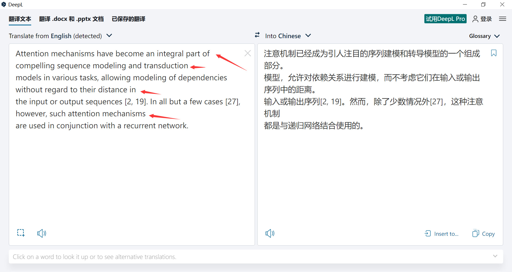

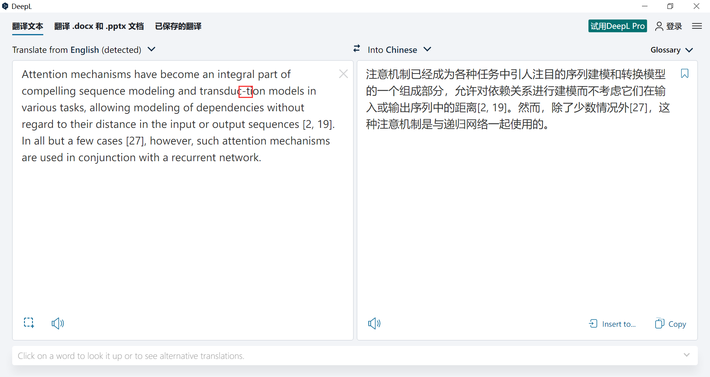

本文会对整个开发过程详细记录，并会在个人Github仓库中提供源代码供大家学习交流使用，有任何关于本软件的建议和反馈均可以通过私信或邮箱（chenxiuyan_t@163.com）的方式联系我。

## 二、开发详细过程

软件功能：
- 智能删除连字符'-'
- 翻译成中文

软件版本号：1.0

开发环境：
- 操作系统：Windows10 
- IDE：Vscode
- 编程语言：Python3.7.0 & PyQT6-6.3.0

### 2.1 整体设计框架图

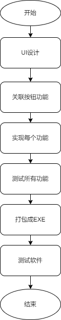

### 2.2 UI设计

设计一个简易版UI，如下：

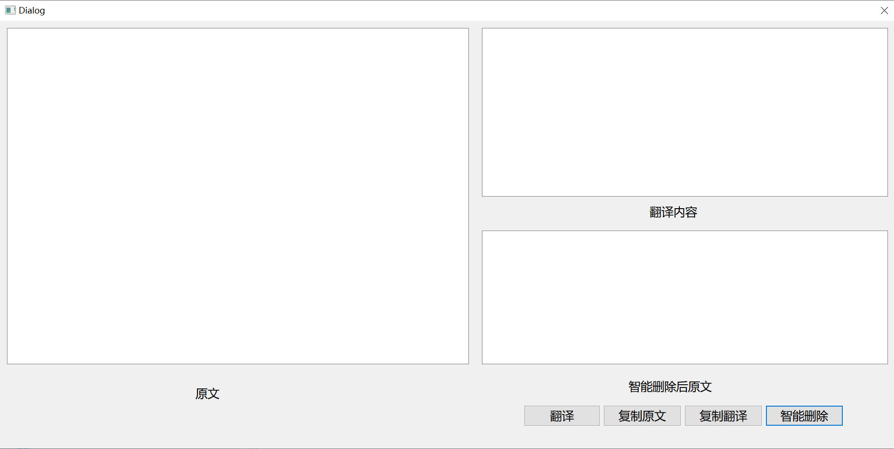

### 2.3 功能实现

#### 2.3.1 智能删除功能

功能实现思路：
- 首先读取原文text中的字符串，并转换成字符串类型
- 通过Split函数将字符串以空格为分隔符分割，记作str_split
- 编写check函数，check函数用于判断str_split中每个字符串里面是否包含连字符，对于有连字符的再通过算法判断是否是合法单词，合法就返回true，非法返回false
- 编写delete_slash函数，针对check函数判断为false的字符串，将其中的连字符删除

按钮联动：点击"智能删除"按钮后，执行智能删除功能，并将删除后的文本显示在"智能删除后原文"对应的text中。

首先简单实现一个deleteFun函数，通过联动"智能删除"按钮，使其能print原文内容。代码和实现效果如下：

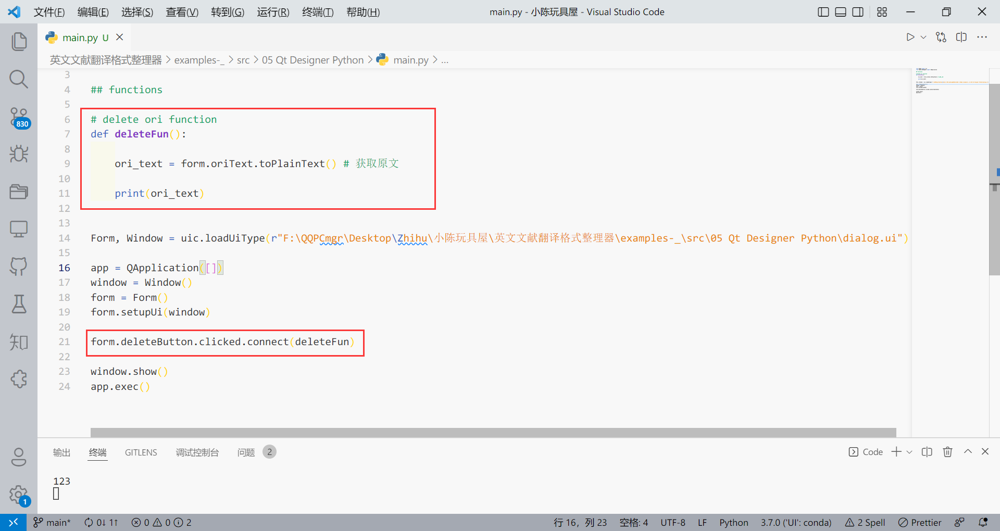

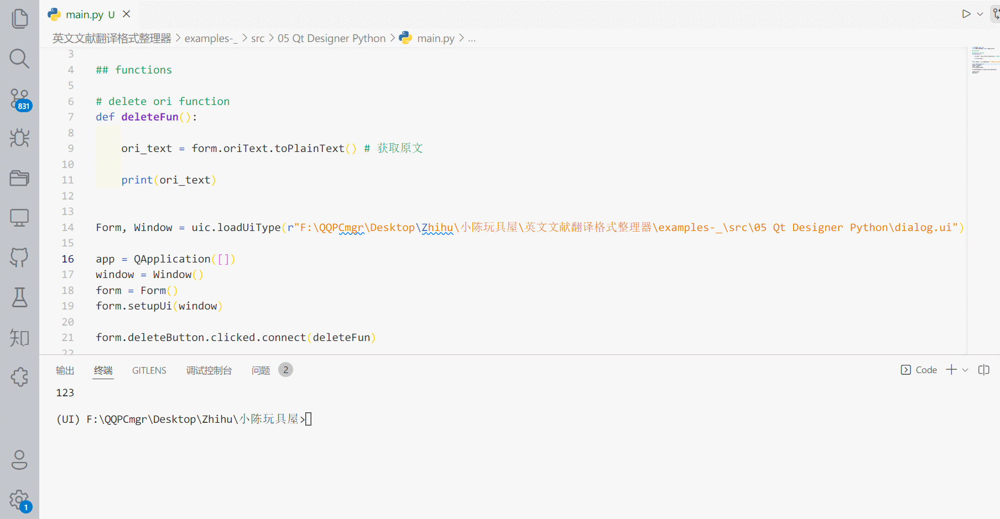

然后实现check和delete_slash函数实现对split后的单词进行合法性检测，并删除连字符。在开发的过程中发现了忽略了几个因素，单词前后的空格和标点符号，通过打补丁后，最终实现测试效果如下：


```python
## functions
d = enchant.Dict("en_US")
# 检测是否是合法单词
def legal_str(str):
    
    return d.check(str)
    

# check function
def check(str):
    
    str = str.strip() # 去除str首尾空格
    
    if (str.find('-')): # 对包含-的字符串判断
        if (legal_str(str)):
            return True
        else :
            return False
        
# delete_slash function
def delete_slash(str):
    
    str = str.strip() # 去除str首尾空格
    
    cnt = 0
    
    # 从前往后删除连字符，直到legal_str返回true 或者删除5次后自动返回
    tmp_str = re.sub(r'[^\w\s-]','',str) # 去除str中的标点符号
    while(legal_str(tmp_str)==False and cnt !=5):
        
        cnt = cnt + 1
        
        # print(tmp_str)
        len_of_str = len(str)
        for i in range(len_of_str):
            if (str[i] == '-'):
                str = list(str)
                str[i] = ''
                str = ''.join(str)
                break;
        tmp_str = re.sub(r'[^\w\s-]','',str) # 去除str中的标点符号
    
    return str
```

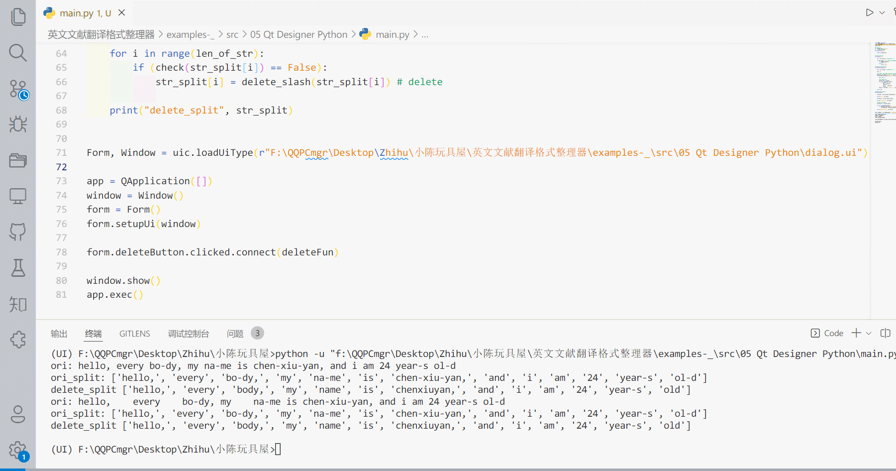

最后将str_split合并成一个字符串，然后写入"智能删除后原文"对应text中。

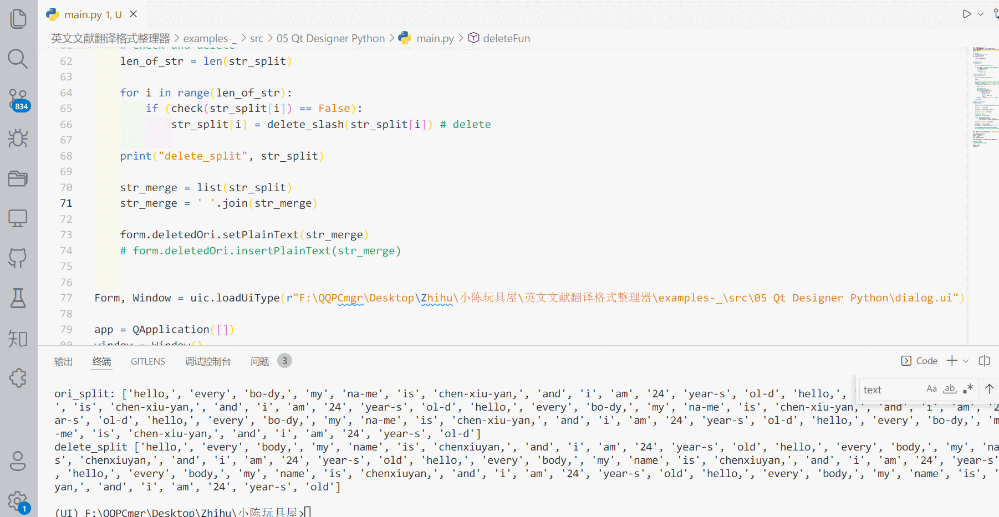

#### 2.3.2 翻译功能

功能实现思路：
- 读取"智能删除后原文"对应的text中文本，进行非空判断，并给出提示
- 调用DeepL翻译API进行翻译
- 将翻译结果显示在"翻译内容"对应的text中

按钮联动：点击"翻译"按钮后，执行上述翻译功能。

开发过程中发现DeepL的授权码不太好整，所以选择更换一个翻译API，最后选择了有道翻译。

代码如下：

```python
def translate(query):
    url = 'http://fanyi.youdao.com/translate'
    data = {
        "i": query,  # 待翻译的字符串
        "from": "AUTO",
        "to": "AUTO",
        "smartresult": "dict",
        "client": "fanyideskweb",
        "salt": "16081210430989",
        "doctype": "json",
        "version": "2.1",
        "keyfrom": "fanyi.web",
        "action": "FY_BY_CLICKBUTTION"
    }
    res = requests.post(url, data=data).json()
    
    len_of_translated = len(res['translateResult'][0])
    
    translated_text = ''
    for i in range(len_of_translated): # 翻译结果有多个，通过循环拼接全部翻译结果
        translated_text = translated_text + res['translateResult'][0][i]['tgt']
        
    return translated_text

## translate into chinese

def translate_fun():
    
    # 自动执行自动删除再翻译
    delete_fun()
    
    ori_text = form.deletedOri.toPlainText() # 获取修改好的原文
    translated_text = translate(ori_text)
    
    form.translatedText.setPlainText(translated_text)   
```

测试效果如下：

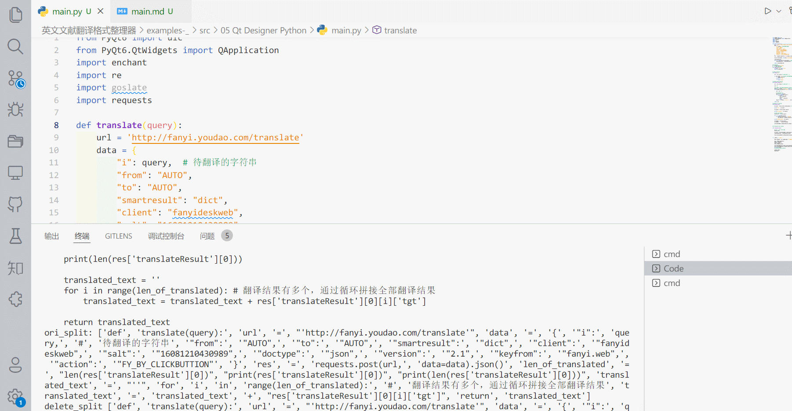

### 2.4 软件打包

打包教程参考知乎一篇文章：https://zhuanlan.zhihu.com/p/162237978

本次打包使用命令：Pyinstaller -F -i ./icon/icon.ico main.py -w

最终打包结果：

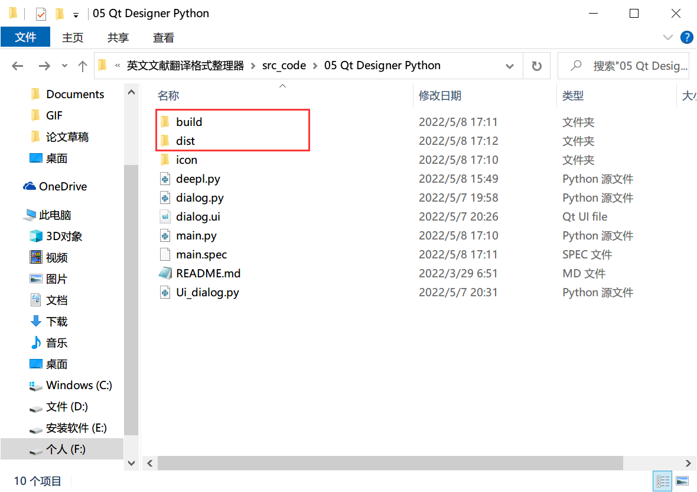

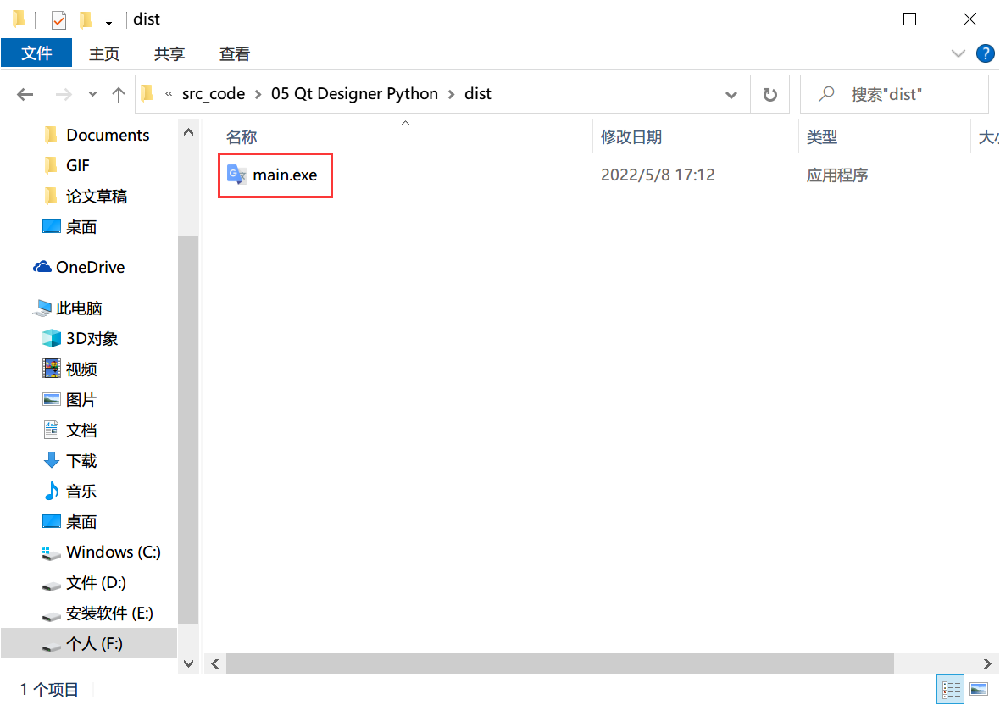

### 2.5 功能测试

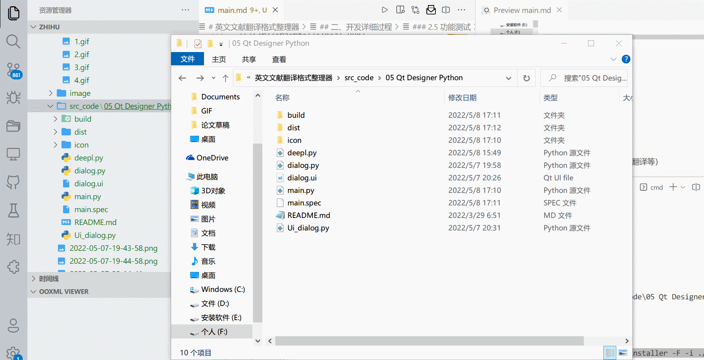

## 三、后续开发内容

- 实现复制原文复制翻译功能
- 增加翻译API选项（谷歌翻译，百度翻译等）
- 增加翻译的语言
- 增加其他智能删除内容（如，智能删除换行符、智能删除空格等）
- 增加自动复制到剪切板功能
- ...（欢迎提供更多开发内容建议）

## 四、参考资料

- PyQT开发demo：https://github.com/pyqt/examples
- 获取text内容：https://blog.csdn.net/weixin_41529093/article/details/110793272
- 按钮联动：https://www.geocalculate.com/7528.html
- 判断单词是否合法：https://www.cnblogs.com/bonelee/p/7771609.html
- 去掉字符串中的标点符号：https://blog.csdn.net/Chihwei_Hsu/article/details/81604272
- 对指定字符串进行替换：https://blog.csdn.net/Hachi_Lin/article/details/104365221
- 字符串以空格拼接：https://blog.csdn.net/yu97271486/article/details/105996934
- DeepL python API使用：https://pypi.org/project/deepl-api/， https://github.com/missuo/deepl?ref=pythonawesome.com
- 有道翻译：https://blog.csdn.net/qq_42951560/article/details/111302487
- 打包成EXE：https://zhuanlan.zhihu.com/p/162237978
- icon下载：https://www.aigei.com/s?q=%E7%BF%BB%E8%AF%91&type=design_icon

## 五、仓库文件详解

dialog.ui为UI设置文件

main.py为主函数

icon文件夹里面为打包图标

dist和build为打包后结果

未提及的其他文件可以忽略